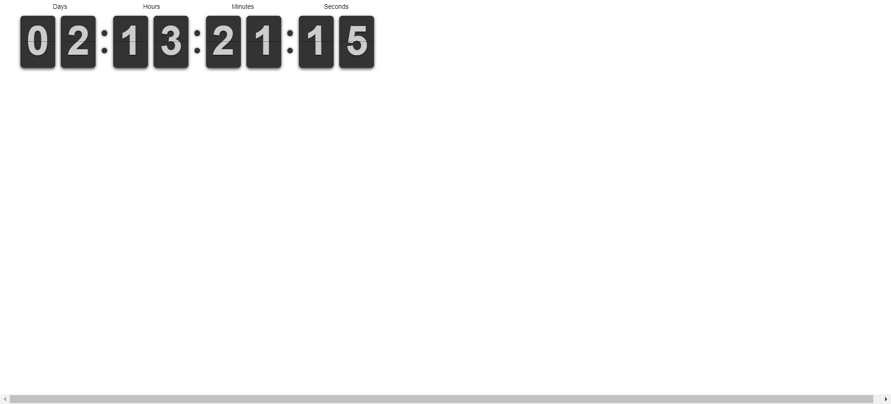

# Clock-flips: A Digital Clock with Flipping Digits



## Description

Clock-flips is a web-based digital clock that features a visually engaging "flip" animation for the digits as they change. This project combines HTML, CSS (with SCSS preprocessing), and JavaScript to create a dynamic and interactive time display. It's designed to be easily customizable and can be integrated into various web applications or used as a standalone clock.

## Key Features

* **Flipping Digit Animation:** Provides a smooth and visually appealing animation as the clock updates.
* **Real-time Updates:** Accurately displays the current time, updating every second.
* **Clean and Modern Design:** Offers a sleek and minimalist aesthetic that can be easily adapted.
* **Customizable Styling:** Leverages SCSS for efficient styling and easy modification of colors, fonts, and layout.
* **Well-Organized Code:** Follows a clear folder structure and includes detailed comments for easy understanding and modification.
* **Icon Integration:** Utilizes Ion Icons and Icons8 for a set of professional and consistent icons.

## Author

**Timi Busayo**

* **Twitter:** [@Timi\_Bee](https://www.twitter.com/Timi_Bee)
* **GitHub Repository:** [https://github.com/TimiBee/Clock-flips](https://github.com/TimiBee/Clock-flips)

## Technologies Used

This project is built using the following technologies:

* **HTML:** The standard markup language for creating web pages, used to structure the clock's content.
* **CSS:** Used for styling the clock, including layout, colors, fonts, and animations.
* **SCSS:** A CSS preprocessor that adds features like variables, nesting, and mixins, enhancing CSS development efficiency.
* **JavaScript:** Provides the dynamic functionality for updating the clock in real-time and handling the flip animations.
* **Ion Icons:** An open-source icon set used for various UI elements.
* **Icons8:** Another source for high-quality icons, providing additional visual resources.
* **Formspree (Optional):** Used for handling form submissions (if you choose to implement a contact form or similar).

## Installation and Setup

1.  **Clone the Repository:**
    ```bash
    git clone [https://github.com/TimiBee/Clock-flips.git](https://github.com/TimiBee/Clock-flips.git)
    cd Clock-flips
    ```
2.  **Open `index.html`:** Simply open the `index.html` file in your preferred web browser to view the clock.


## Customization Guide

The project is designed to be easily customizable. Here's how:

* **HTML Structure:** The `index.html` file is well-organized with clear comments, allowing you to easily modify the structure of the clock.
* **CSS Styling:** The `assets/scss/` directory contains the SCSS files, which are highly recommended for making styling changes. SCSS offers features like variables, nesting, and mixins, making it easier to manage and maintain styles. The compiled CSS files are in `assets/css/`.
* **JavaScript Functionality:** The `assets/js/` directory contains the JavaScript files. The code is commented to explain the functionality of different functions and selections, enabling you to modify the clock's behavior.
* **Icons:** The project uses Ion Icons and Icons8. You can replace these with Font Awesome, Material Icons, or any other icon library you prefer. Remember to update the HTML accordingly if you change icon libraries.


## Contributing

Contributions to the Clock-flips project are welcome! If you have suggestions, bug reports, or would like to add new features, please follow these steps:

1.  **Fork the repository.**
2.  **Create a new branch for your feature or bug fix.**
3.  **Make your changes and commit them.**
4.  **Push your changes to your fork.**
5.  **Submit a pull request.**

## Support

If you encounter any issues or need assistance with customization, feel free to reach out to me:

* **Twitter:** [@Timi\_Bee](https://www.twitter.com/Timi_Bee)


